# FIAP - Faculdade de Informática e Administração Paulista

<p align="center">
<a href= "https://www.fiap.com.br/"></a>
</p>

<br>

# Projeto: fiap_sprint3_reply

## Atividade em Grupo: FIAP - 1TIAOB - 2025/1 - Fase4 Sprint 2 - Reply

## 👨‍🎓 Integrantes: 
- <a href="">Alice C. M. Assis - RM 566233</a>
- <a href="">Leonardo S. Souza - RM 563928</a>
- <a href="">Lucas B. Francelino - RM 561409</a>
- <a href="">Pedro L. T. Silva - RM 561644</a>
- <a href="">Vitor A. Bezerra - RM 563001</a>

## 👩‍🏫 Professores:
### Tutor(a) 
- <a href="proflucas.moreira@fiap.com.br">Lucas Gomes Moreira</a>
### Coordenador(a)
- <a href="profandre.chiovato@fiap.com.br">André Godoi Chiovato</a>
- 
**Confira o vídeo de apresentação do projeto clicando no link:**

[https://www.youtube.com/watch?v=AHPvV46sFlQ](https://www.youtube.com/watch?v=AHPvV46sFlQ)

# 1. Descrição do Projeto

A coleta de dados em ambientes industriais modernos é realizada através de sensores conectados a sistemas embarcados, como o ESP32. Esses sensores monitoram variáveis como temperatura, vibração, luminosidade e qualidade do ar, fornecendo informações críticas para análise e predição de falhas.

Com a chegada da Indústria 4.0, empresas têm apostado fortemente na digitalização do chão de fábrica, conectando sensores e dispositivos a plataformas de dados em nuvem. Isso permite a análise em tempo real e a tomada de decisões baseadas em dados.

Nesta fase do desafio, utilizamos a simuação criada na fase anterior para treinar uma IA a qual prevê se a máquina precisa de manutenção ou não.

# 2. Objetivos do Projeto

- Modelar um banco de dados relacional para armazenar leituras de sensores e informações de equipamentos industriais.
- Criar e documentar o diagrama ER (Entidade-Relacionamento) e o script SQL de criação das tabelas.
- Simular a coleta de dados de sensores utilizando ESP32 e enviar os dados para uma API desenvolvida em Python.
- Implementar uma API para receber, validar e armazenar os dados dos sensores no banco de dados.
- Desenvolver e documentar um modelo de Machine Learning para prever a necessidade de manutenção dos equipamentos, utilizando dados coletados.
- Disponibilizar o código-fonte do modelo de ML (Python ou Jupyter Notebook) e a base de dados utilizada para treino/teste (CSV ou equivalente).
- Apresentar gráficos, prints e principais resultados obtidos com o modelo de ML.
- Elaborar documentação explicando a modelagem do banco, a implementação do ML e os resultados alcançados.

# 3. Justificativa dos Sensores Escolhidos

- **Sensor de Temperatura (MPU6050):** Permite monitorar o aquecimento de equipamentos, prevenindo falhas por superaquecimento.
- **Sensor de Vibração (MPU6050):** Essencial para identificar padrões anormais que podem indicar desgaste ou mau funcionamento de máquinas.
- **Sensor de Luminosidade (LDR):** Útil para monitorar ambientes industriais onde a iluminação pode impactar processos ou segurança.

Esses sensores foram escolhidos por serem amplamente utilizados em ambientes industriais e facilmente simuláveis no Wokwi.

# 4. Esquema do Circuito Simulado

<p align="center">
  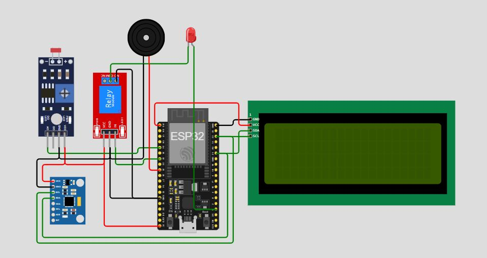
</p>

- O ESP32 está conectado ao sensor MPU6050 (I2C) e ao LDR (analógico).
- LED, relé e buzzer são usados para alertas visuais e sonoros.
- O LCD exibe informações em tempo real sobre os sensores.

# 5. Trechos Representativos do Código

O código que controla o ESP32 pode ser encontrado no arquivo [src/wokwi/src/sketch.cpp](src/wokwi/src/sketch.cpp). A seguir, apresentamos trechos representativos do código que demonstram a leitura dos sensores, o envio dos dados para a API e o alerta de vibração.

### Leitura dos Sensores e Envio dos Dados

```cpp
// Leitura do LDR
int ldrValue = analogRead(LDR_PIN);
int lux = map(ldrValue, 0, 4095, 0, 2000); 
doc["lux"] = lux;

// Leitura da temperatura do MPU6050
int rawTemp = mpu.getTemperature();
float tempC = rawTemp / 340.0 + 36.53;
doc["temperatura"] = tempC;

// Leitura da vibração (aceleração)
mpu.getAcceleration(&ax_raw, &ay_raw, &az_raw);
float ax = ax_raw / 16384.0;
float ay = ay_raw / 16384.0;
float az = az_raw / 16384.0;
doc["acelerometro_x"] = ax;
doc["acelerometro_y"] = ay;
doc["acelerometro_z"] = az;
```

### Alerta de Vibração

```cpp
if (vibracaoMedia > LIMIAR_VIBRACAO) {
  lcd.setCursor(0, 1);
  lcd.print("#ALERTA DE VIBRACAO#");
  // Ativa LED, relé e buzzer
}
```

### Envio dos Dados para a API

```cpp
if (iniciou_sensor) {
  int httpcode = post_data(doc, post_sensor);
  if (httpcode >= 200 && httpcode < 300) {
    Serial.println("Dados enviados com sucesso!");
  }
}
```

# 6. Registro do Funcionamento da Simulação

As leituras dos sensores são coletadas pelo ESP32 e enviadas automaticamente para a API via requisições HTTP. O envio ocorre a cada ciclo de leitura, garantindo que os dados estejam sempre atualizados no banco de dados para análise posterior. O monitor serial e o display LCD exibem em tempo real as leituras e alertas, enquanto a API armazena cada registro recebido.

- **Print do Monitor Serial:**

<p align="center">
  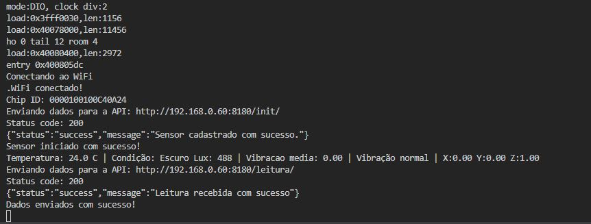
</p>

- **Print do LCD:**

<p align="center">
  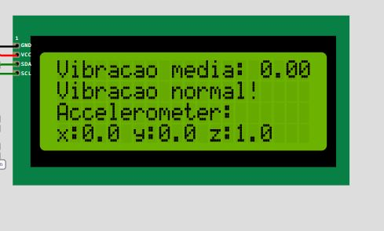
</p>

## Conexão com o Wi-Fi e envio de dados para a API

Para que a simulação funcione corretamente, é necessário configurar a conexão com o Wi-Fi simulado do Wokwi e definir o IP do servidor local da API.

No momento, neste projeto, a API e a simulação do ESP32 estão rodando localmente. Para a configuração funcionar corretamente, é necessário alterar o arquivo [platformio.ini](src/wokwi/platformio.ini) e setar a variável 'API_URL' para 'http://**IP DE SUA MÁQUINA NA REDE LOCAL**:8180', conforme exemplo abaixo:

```plaintext
[env:esp32]
platform = espressif32
framework = arduino
board = esp32dev
lib_deps = 
    bblanchon/ArduinoJson@^7.4.1
    electroniccats/MPU6050@^1.4.3
    marcoschwartz/LiquidCrystal_I2C@^1.1.4
build_flags = 
    '-D API_URL="http://192.168.0.60:8180"'
    '-D NETWORK_SSID="Wokwi-GUEST"'
    '-D NETWORK_PASSWORD=""'
```

> NOTA1: Não sete o IP da API para localhost ou 127.0.0.1, pois o ESP32 não conseguirá se conectar a ele. O localhost do ESP32 é o próprio ESP32, e não a máquina onde o servidor está rodando.

> NOTA2: Caso você esteja rodando a simulação e mesmo assim o ESP32 não consiga se conectar à API, verifique se o firewall da sua máquina está bloqueando a porta 8180. Se estiver, libere a porta para que o ESP32 consiga se conectar.

Após configurado o arquivo `platformio.ini`, você poderá iniciar a simulação do ESP32 no Wokwi. O circuito irá coletar os dados dos sensores e enviá-los para a API, que por sua vez irá armazenar os dados no banco de dados.

## API para salvar os dados do sensor

Neste projeto, foi implementada uma API básica utilizando o FastAPI para receber os dados do sensor e armazená-los no banco de dados. A API permite que o ESP32 envie as leituras dos sensores, que são então salvas no banco de dados para posterior análise e visualização.

Para facilitar os testes, a API está configurada para rodar localmente na porta 8180 e será iniciada automaticamente junto ao dashboard ao executar o comando `streamlit run main_dash.py` quando a variável de ambiente `ENABLE_API` for setada como `true`.

No entanto, caso queira, a API pode ser executada separadamente executando o arquivo [api_basica.py](src/wokwi_api/api_basica.py).

Explicações mais detalhadas sobre como iniciar o dashboard e variáveis de ambiente serão apresentadas na seção "Instalando e Executando o Projeto", a seguir neste mesmo README.md.

# 7. Armazenamento de Dados em Banco SQL com Python

<p align="center">
  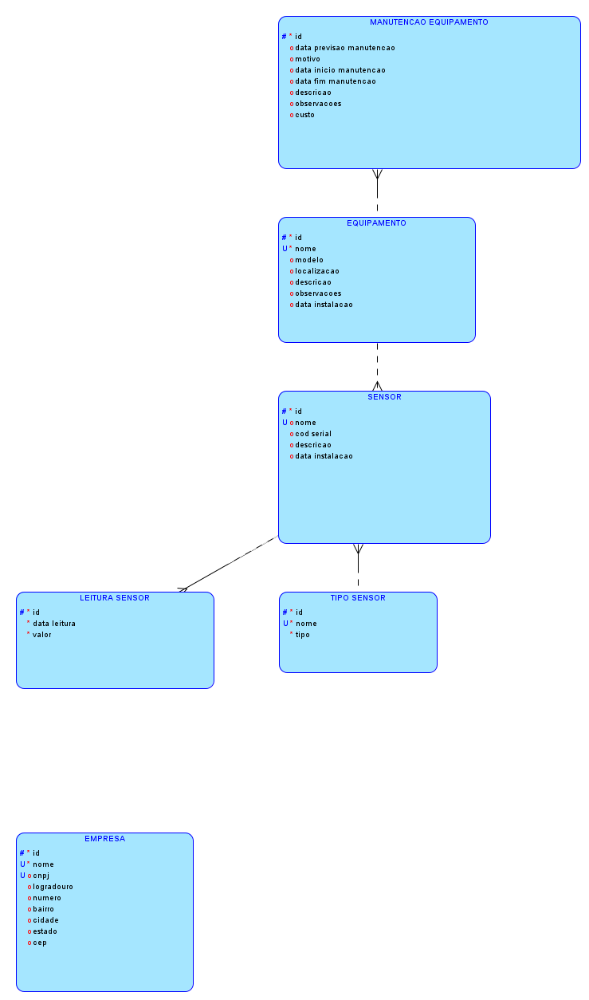
</p>


<p align="center">
  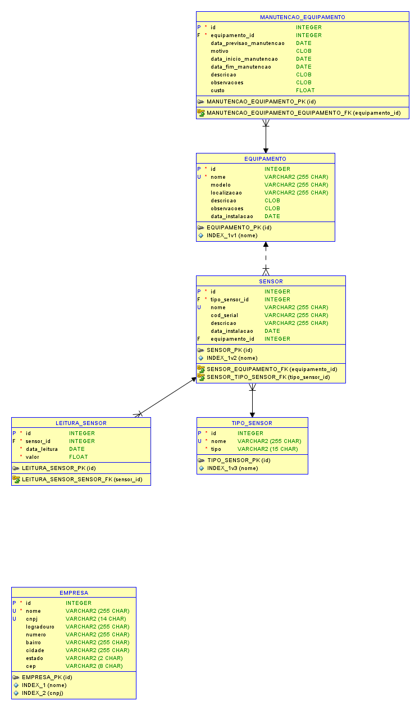
</p>


Modelo de Entidade-Relacionamento:

Tabela: EQUIPAMENTO
  - id (INTEGER NOT NULL) [PK]
  - nome (VARCHAR(255) NOT NULL)
  - modelo (VARCHAR(255))
  - localizacao (VARCHAR(255))
  - descricao (TEXT(2000))
  - observacoes (TEXT(2000))
  - data_instalacao (DATETIME)

Tabela: TIPO_SENSOR
  - id (INTEGER NOT NULL) [PK]
  - nome (VARCHAR(255) NOT NULL)
  - tipo (VARCHAR(15) NOT NULL)

Tabela: SENSOR
  - id (INTEGER NOT NULL) [PK]
  - tipo_sensor_id (INTEGER NOT NULL) [FK -> TIPO_SENSOR]
  - nome (VARCHAR(255))
  - cod_serial (VARCHAR(255))
  - descricao (VARCHAR(255))
  - data_instalacao (DATETIME)
  - equipamento_id (INTEGER) [FK -> EQUIPAMENTO]

Tabela: LEITURA_SENSOR
  - id (INTEGER NOT NULL) [PK]
  - sensor_id (INTEGER NOT NULL) [FK -> SENSOR]
  - data_leitura (DATETIME NOT NULL)
  - valor (FLOAT NOT NULL)

Tabela: EMPRESA
  - id (INTEGER NOT NULL) [PK]
  - nome (VARCHAR(255) NOT NULL)
  - cnpj (VARCHAR(14))
  - logradouro (VARCHAR(255))
  - numero (VARCHAR(255))
  - bairro (VARCHAR(255))
  - cidade (VARCHAR(255))
  - estado (VARCHAR(2))
  - cep (VARCHAR(8))

Tabela: MANUTENCAO_EQUIPAMENTO
  - id (INTEGER NOT NULL) [PK]
  - equipamento_id (INTEGER NOT NULL) [FK -> EQUIPAMENTO]
  - data_previsao_manutencao (DATETIME)
  - motivo (TEXT(2000))
  - data_inicio_manutencao (DATETIME)
  - data_fim_manutencao (DATETIME)
  - descricao (TEXT(2000))
  - observacoes (TEXT(2000))
  - custo (FLOAT)

A modelagem do banco de dados foi pensada para garantir a rastreabilidade, integridade e flexibilidade do sistema de monitoramento de sensores e equipamentos. Abaixo, explico o motivo da inclusão de cada entidade e campo:

**Tabela: EMPRESA**
***Permite registrar informações das empresas responsáveis pelos equipamentos monitorados, facilitando a gestão multiempresa.***
- **id**: Identificador único da empresa, fundamental para relacionamentos e integridade dos dados.
- **nome**: Permite identificar a empresa de forma única no sistema.
- **cnpj**: Cadastro Nacional da Pessoa Jurídica, essencial para validação e identificação fiscal.
- **logradouro, numero, bairro, cidade, estado, cep**: Campos necessários para armazenar o endereço completo da empresa, facilitando localização e contato.

**Tabela: EQUIPAMENTO**
***Representa cada máquina ou dispositivo monitorado, permitindo associar sensores e manutenções.***
- **id**: Identificador único do equipamento, necessário para relacionamentos e controle individual.
- **nome**: Nome do equipamento, facilita a identificação e evita duplicidade.
- **modelo**: Permite diferenciar equipamentos do mesmo tipo, mas de modelos distintos.
- **localizacao**: Indica onde o equipamento está instalado, importante para manutenção e monitoramento.
- **descricao**: Campo para detalhar características específicas do equipamento.
- **observacoes**: Espaço para anotações gerais, como histórico de uso ou particularidades.
- **data_instalacao**: Registra quando o equipamento foi instalado, útil para controle de manutenção preventiva.

**Tabela: TIPO_SENSOR**
***Define os tipos de sensores disponíveis (ex: temperatura, vibração), facilitando a categorização e expansão futura.***
- **id**: Identificador único do tipo de sensor.
- **nome**: Nome do tipo de sensor, garante unicidade e facilita buscas.
- **tipo**: Especifica a categoria do sensor (ex: temperatura, umidade), importante para validação e processamento dos dados.

**Tabela: SENSOR**
***Representa cada sensor físico instalado, permitindo rastrear leituras e manutenções.***
- **id**: Identificador único do sensor.
- **tipo_sensor_id**: Relaciona o sensor ao seu tipo, garantindo integridade e padronização.
- **nome**: Nome do sensor, facilita a identificação.
- **cod_serial**: Código serial do sensor, importante para rastreabilidade física.
- **descricao**: Detalhes adicionais sobre o sensor.
- **data_instalacao**: Data de instalação do sensor, relevante para manutenção e histórico.
- **equipamento_id**: Relaciona o sensor ao equipamento onde está instalado, permitindo rastrear medições por equipamento.

**Tabela: LEITURA_SENSOR**
***Armazena cada leitura realizada pelos sensores, base para análises e alertas.***
- **id**: Identificador único da leitura.
- **sensor_id**: Relaciona a leitura ao sensor correspondente, garantindo rastreabilidade.
- **data_leitura**: Data e hora da leitura, essencial para análises temporais.
- **valor**: Valor capturado pelo sensor, principal dado para monitoramento e análise.
- 
**Tabela: MANUTENCAO_EQUIPAMENTO**
***ermite registrar manutenções preventivas e corretivas dos equipamentos, integrando histórico operacional.***
- **id**: Identificador único da manutenção.
- **equipamento_id**: Relaciona a manutenção ao equipamento.
- **data_previsao_manutencao**: Data prevista para manutenção.
- **motivo**: Motivo da manutenção.
- **data_inicio_manutencao, data_fim_manutencao**: Período da manutenção.
- **descricao, observacoes**: Detalhes e anotações sobre a manutenção.
- **custo**: Valor gasto na manutenção.

Cada entidade e campo foi incluído para garantir a integridade dos dados, facilitar consultas e permitir a expansão futura do sistema, como integração com novos tipos de sensores, equipamentos ou empresas.

## Models e Python

Para realizar a conversão das linhas e colunas da database para Python, foram definidas classes as quais são responsáveis por fazer as operações CRUD e demais funcionalidades do banco de dados.
Essas classes podem ser encontradas na pasta `src/database/models`, e todas elas herdam a classe principal chamada [Model](src/database/tipos_base/model.py).

## Script de Criação do Banco de Dados

O script para criação do banco de dados e tabelas pode ser encontrado no arquivo [assets/table_creation.ddl](assets/table_creation.ddl).
**Este script não precisa ser executado manualmente, pois o banco de dados é criado automaticamente ao iniciar o dashboard.**

# 8. Instalando e Executando o Projeto

O sistema foi desenvolvido em Python e utiliza um banco de dados SQLite para armazenar os dados. O código é modularizado, permitindo fácil manutenção e expansão.

## 📦 Requisitos
- Python 3.13.2
- Bibliotecas:
  - oracledb==3.1.0
  - pandas==2.2.3
  - matplotlib==3.10.1
  - streamlit==1.44.1
  - SQLAlchemy==2.0.40
  - fastapi==0.115.12
  - pydantic==2.11.5
  - uvicorn==0.34.3
  - dotenv==0.9.9
  - seaborn==0.13.2
  - plotly==6.1.2
  - joblib==1.5.2
  - scipy==1.16.1
  - scikit-learn==1.7.1

## 📂 Instalação

- Instale as dependências utilizando o arquivo requirements.txt:
    ```bash
    pip install -r requirements.txt
    ```

- Para iniciar o dashboard interativo, execute o seguinte comando no terminal:
    ```bash
    streamlit run main_dash.py
    ```

## Arquivo de Configuração

O projeto utiliza um arquivo especial denominado **`.env`** para armazenar variáveis de ambiente sensíveis, como credenciais de banco de dados e chaves de APIs externas. Por razões de segurança, esse arquivo **não deve ser compartilhado publicamente**.

### 📄 O que é o `.env`?

O `.env` é um arquivo-texto simples, onde cada linha define uma variável de ambiente no formato `NOME_VARIAVEL=valor`. Esse método permite separar informações confidenciais do código-fonte, facilitando a configuração do sistema para diferentes ambientes (desenvolvimento, testes, produção, etc).

### 🔑 Variáveis Utilizadas

| Variável      | Descrição                                                                                                | Exemplo de Valor                  |
|---------------|----------------------------------------------------------------------------------------------------------|-----------------------------------|
| LOGGING_ENABLED      | Define se o logger da aplicação será ativado (`true` ou `false`)                                         | `true` ou `false`                 |
| ENABLE_API      | Define se a API que salva os dados do sensor será ativada juntamente com o dashboard (`true` ou `false`) | `true` ou `false`                 |

### ⚙️ Exemplo de arquivo `.env`

```plaintext
LOGGING_ENABLED=true
ENABLE_API=true
```

# 9. Treinamento do modelo de Machine Learning

O treinamento do modelo de Machine Learning foi realizado utilizando a biblioteca Scikit-Learn em Python, podendo ser verificano no arquivo [treinamento_ml.ipynb](src/machine_learning/jupyter/treinamento_ml.ipynb).
Nele também estão disponíveis análises exploratórias dos dados, pré-processamento e avaliação dos modelos, bem como células markdown explicativas.

O dataset utilizado para o treinamento do modelo pode ser encontrado na pasta [leituras_com_equipamento.csv](src/machine_learning/jupyter/leituras_com_equipamento.csv).

Ainda, os modelos treinados e otimizados foram salvos em arquivos `.pkl` e podem ser encontrados na pasta [modelos_otimizados_salvos](assets/modelos_otimizados_salvos).

# 10. 📊 Resultados do Machine Learning

Este projeto apresenta, em uma interface interativa com Streamlit, os resultados de um processo de otimização de modelos de machine learning.

São exibidas métricas de desempenho, comparações gráficas e análise de tempos de treinamento, auxiliando na interpretação dos modelos avaliados.

🚀 Funcionalidades

✅ Carregamento automático dos resultados e tempos de treinamento dos modelos.

✅ Exibição em tabela interativa com as principais métricas de avaliação.

✅ Visualizações gráficas:

Acurácia

F1-Score

ROC AUC

Tempo de Treinamento

✅ Resumos explicativos dos resultados e insights obtidos.

✅ Conclusão sobre melhores modelos considerando precisão, interpretabilidade e custo computacional.

📊 Exemplos de Resultados


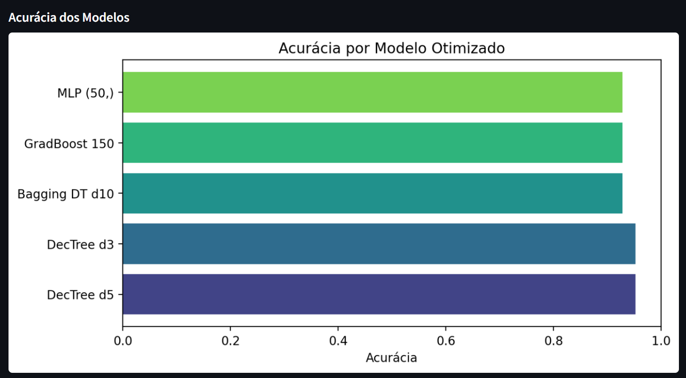
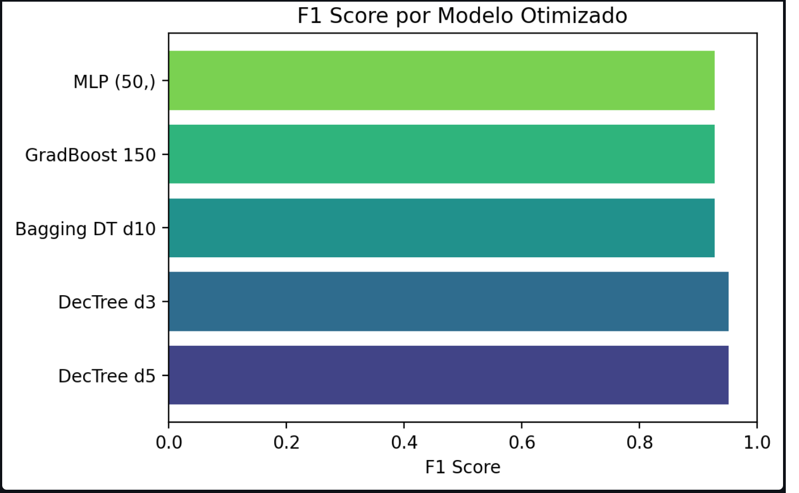

# 9. Previsão Manual com Modelos Treinados

Também é possível realizar previsões manuais utilizando modelos de machine learning previamente treinados e salvos em arquivos .joblib, conforme demonstrado na imagem abaixo:

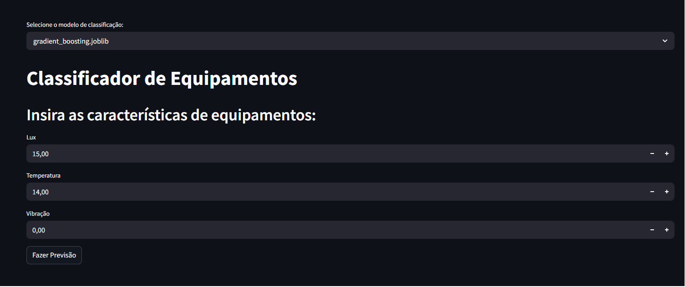

🤖 Classificador de Equipamentos

Este módulo fornece uma interface em Streamlit para carregar modelos de machine learning previamente treinados (arquivos .joblib) e realizar previsões manuais com base em características inseridas pelo usuário.

🚀 Funcionalidades

✅ Carregamento dinâmico de modelos de classificação salvos em .joblib.

✅ Interface simples para entrada de dados (Lux, Temperatura, Vibração).

✅ Previsão com retorno textual:

"Manutenção Necessária"

"Sem Manutenção Necessária"

✅ Seleção do modelo desejado através de um menu interativo.

📊 Exemplo de Uso
Entrada:

Lux = 15

Temperatura = 14

Vibração = 0

Saída:

✅ Sem Manutenção Necessária
(ou)

⚠️ Manutenção Necessária


# 11. Importando a Base de dados utilizada pelo Grupo

As tabelas com os dados utilizados no sistema podem ser encontradas na pasta em [assets/database_export.zip](assets/database_export.zip).

O Grupo disponibilizou uma base de dados inicial para facilitar o uso do sistema. Para importar essa base de dados, siga os passos abaixo:

1. O usuário deve selecionar a opção "Importar Banco de Dados" no menu principal.
<p align="center">
  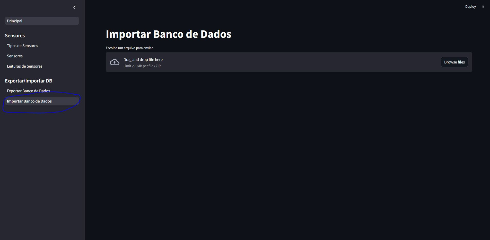
</p>

2. Selecione o arquivo ZIP localizado em [assets/database_export.zip](assets/database_export.zip), espere carregar, role a página até o final e clique no botão "Salvar no Banco de Dados".
<p align="center">
  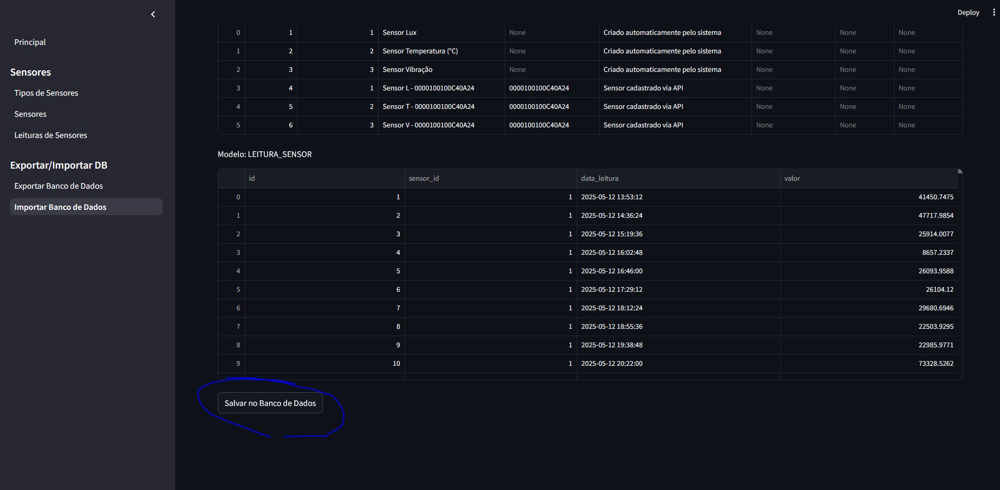
</p>

3. Não feche a janela e espere a operação ser concluída. Após a conclusão, o sistema irá exibir uma mensagem de sucesso. Caso ocorra algum erro, tente novamente.

<p align="center">
  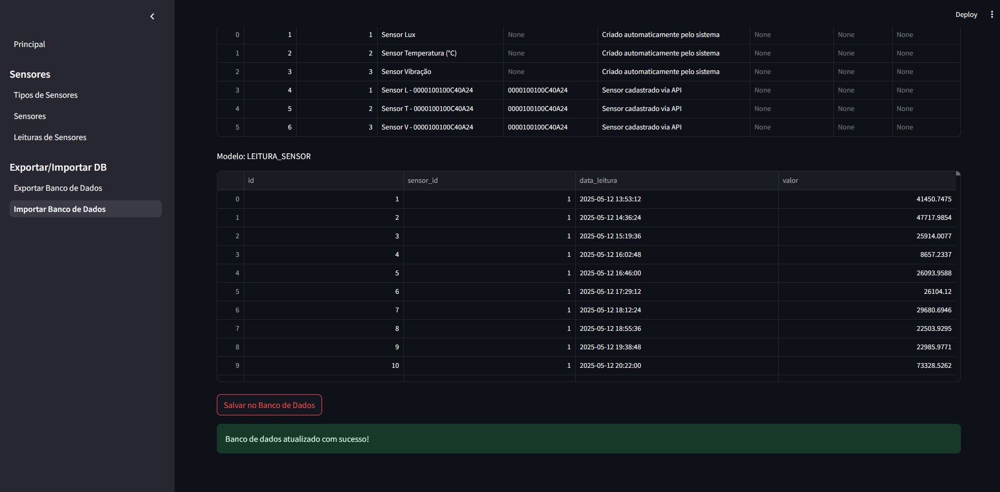
</p>


## 📁 Estrutura de pastas

Dentre os arquivos e pastas presentes na raiz do projeto, definem-se:

- <b>.streamlit</b>: Pasta que contém arquivos de configuração do Streamlit, como o tema da interface e a organização da barra lateral.
- <b>assets</b>: Diretório destinado ao armazenamento de elementos não estruturados do projeto, como imagens e ícones utilizados no dashboard.
- <b>src</b>: Diretório principal que contém todo o código-fonte desenvolvido ao longo das fases do projeto. Ele está organizado nos seguintes submódulos:
  - <b>dashboard</b>: Código responsável pela construção do dashboard, desenvolvido em Python com uso da biblioteca Streamlit. ([dashboard](src/dashboard/))
  - <b>database</b>: Módulo responsável pelas operações de banco de dados, incluindo conexões, inserções, listagens, edições e exclusões de registros.
  - <b>logger</b>: Código responsável por registrar (logar) todas as operações executadas no sistema, garantindo rastreabilidade.
  - <b>plots</b>: Contém o código responsável pela geração de gráficos e visualizações, utilizado para exibir dados de forma clara e intuitiva no dashboard.
  - <b>wokwi</b>: Contém o código do sensor ESP32 utilizado na simulação de sensores.
  - <b>wokwi_api</b>: Contém o código responsável por criar a API que vai salvar as leituras dos sensores no banco de dados.
- <b>.env</b>: Arquivo de configuração que contém as chaves de API e outras variáveis de ambiente necessárias para o funcionamento do sistema. É necessário criar este arquivo na raiz do projeto, conforme orientações na seção "Arquivo de Configuração".
- <b>.gitignore</b>: Arquivo que especifica quais arquivos e pastas devem ser ignorados pelo Git, evitando que informações sensíveis ou desnecessárias sejam versionadas. É importante garantir que o arquivo `.env` esteja incluído neste arquivo para evitar o upload de chaves de API e outras informações sensíveis.
- <b>README</b>: Arquivo de documentação do projeto (este que está sendo lido), com orientações gerais, instruções de uso e contextualização.
- <b>main_dash</b>: Arquivo principal para a execução do dashboard. Está localizado na raiz do projeto com o objetivo de evitar problemas com importações de módulos internos.
- <b>requirements.txt</b>: Arquivo que lista todas as dependências do projeto, necessário para a instalação do ambiente virtual. Deve ser utilizado com o comando `pip install -r requirements.txt` para instalar as bibliotecas necessárias.

## 🗃 Histórico de versionamento

* **0.2.0 - 11/06/2025** – README versão final
* **0.1.0 - 23/05/2025** – Versão preliminar da nossa aplicação

## 📋 Licença

<p xmlns:cc="http://creativecommons.org/ns#" xmlns:dct="http://purl.org/dc/terms/"><a property="dct:title" rel="cc:attributionURL" href="https://github.com/agodoi/template">MODELO GIT FIAP</a> por <a rel="cc:attributionURL dct:creator" property="cc:attributionName" href="https://fiap.com.br">Fiap</a> está licenciado sobre <a href="http://creativecommons.org/licenses/by/4.0/?ref=chooser-v1" target="_blank" rel="license noopener noreferrer" style="display:inline-block;">Attribution 4.0 International</a>.</p>


